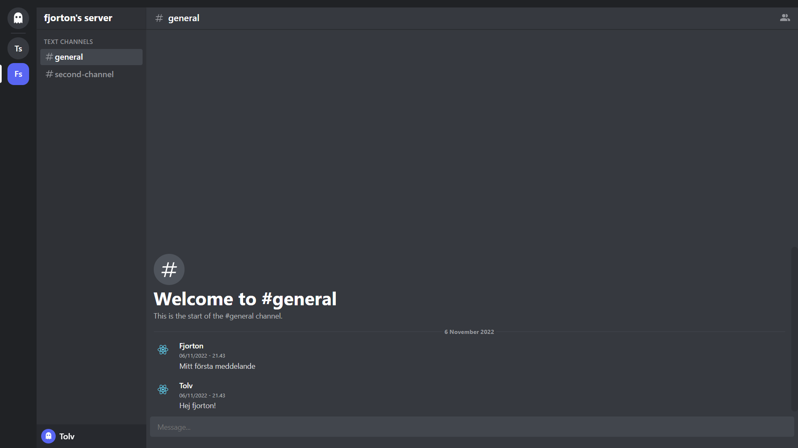

<div id="top"></div>

<!-- PROJECT LOGO -->
<br />
<div align="center">
  <a href="https://github.com/1Tolv2/chat-app-typescript">
    
  </a>

<h3 align="center">Chat application - Simple Discord copy</h3>

  <p align="center">
    Full stack application - React, Express, PostgreSQL
    <br />
    <a href="https://github.com/1Tolv2/chat-app-typescript"><strong>Explore the docs »</strong></a>
    <br />
    <br />
    <a href="https://github.com/1Tolv2/chat-app-typescript/issues">Propose Feature</a>
	  ·
    <a href="https://github.com/1Tolv2/chat-app-typescript/issues">Report Bug</a>
  </p>
</div>

<!-- ABOUT THE PROJECT -->
## About The Project

This is a simplified discord application with channels and servers, running sockets for updating of the chat feeds.

The application can be run using docker compose or locally.
<div align="center">

</div>

## Built with
* [](https://reactjs.org/)
* [](https://expressjs.com/)
* [](https://www.postgresql.org/)

<!-- GETTING STARTED -->
## Getting Started

To setup a local copy follow the steps below

### Prerequisites

* NPM - https://nodejs.org/en/download/
* Docker - https://docs.docker.com/get-docker/

### Installation
 
1. First start cloning the repo by entering the below command in your terminal.
   ```sh
   git clone https://github.com/1Tolv2/chat-app-typescript.git
   ```
2. After cloning the repository, cd in to the new folder and install.
   ```sh
   npm install
   ```
3. 
   a. Start up the application by running the below command from the api workspace aswell as from the client workspace.
   ```sh
   npm start
   ```
    b. Start up the application by running the below command from the root folder 
    ```sh
    docker compose up --build
    ```
4. Open <a href="http://http://localhost:3000/">http://http://localhost:3000/</a> in your prefered browser.
The page reloads as you make changes and save your code.

